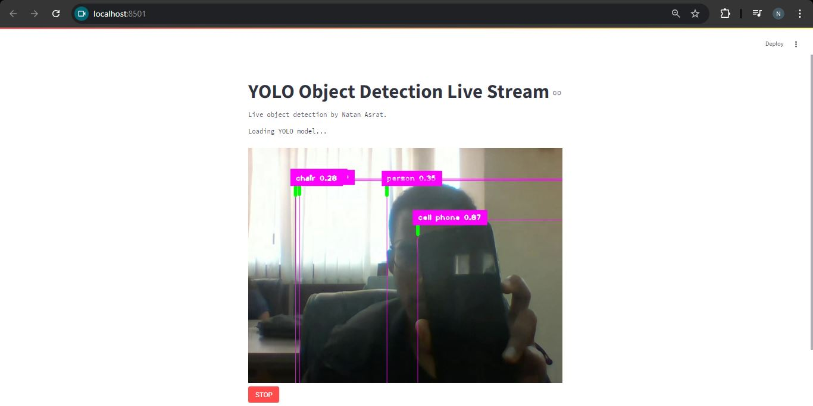

# Object Detection with YOLO v8
- In this project, i implemented a simple object detection system using YOLO to detect objects from the webcam of my pc.

# Setup
- Create virtual environment:  `python -m venv venv`
- Activate virtual environment: `call venv/Scripts/activate.bat` in cmd
- Install dependencies: `pip install -r requirements.txt`
- Run on streamlit: `streamlit run app.py`

- `pip install -r requirements.txt`

- 

# Libraries
- Ultralytics
- cvzone
- opencv
- ipykernel

## Contact
 - LinkedIn: [Natan Asrat](https://linkedin.com/in/natan-asrat)
 - Gmail: nathanyilmaasrat@gmail.com
 - Telegram: [Natan Asrat](https://t.me/fail_your_way_to_success)
 - Youtube: [Natville](https://www.youtube.com/@natvilletutor)